<h1 align="center">Hi there, I'm Parakh 👋</h1>

  

  

---

### 🙋‍♂️ About Me

- 🔭 Interested in **Machine Learning**, **Artificial Intelligence**, and **Data Structures & Algorithms**
- 🌱 Currently working on ML projects in **Google Colab**, and interning at **UHS Heaven Space Pvt Ltd** as AI Researcher
- 🤝 Looking to collaborate on **Machine Learning** projects
- 📫 Reach me at **[parakhvirnawe24@gmail.com](mailto:parakhvirnawe24@gmail.com)**
- 😄 Pronouns: **He/Him**
- ⚡ Fun fact: I enjoy solving coding problems

---

### 🛠️ Tech Stack

  
  
  
  
  
  
  
  

---

### 📊 GitHub Stats

  
  

  

---

### 🤝 Let's Connect

  <a href="mailto:parakhvirnawe24@gmail.com">Email</a> ·
  <a href="#">LinkedIn</a> ·
  <a href="#">LeetCode</a>

<i>Thanks for stopping by! ⭐ from a repo you like if you find it useful.</i>

